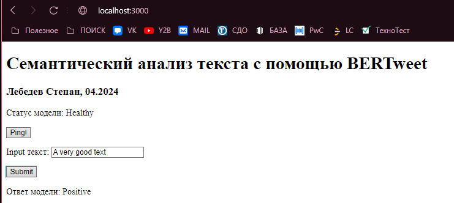

# TextSentiment

A Service to analyzie a text and determine its sentiment metric.  
Сервис сентимент-анализа текста. Состоит из двух модулей:  

- **UI**
- **Model backend**

## Что можно улучшить в проекте

1. Модель обучена работать с корпусом английского текста, на русском отрабатывает не очень. Заметил я это уже на финальной стадии. При дальнейшей работе над проектом необходимо выбрать другую модель \ добучить эту на корпус русского текста \ переводить текст.  
2. Создавая проект, я не упирался в визуальное качество frontend UI. Я создал простой static express проект, где нет CSS. Прошу закрыть глаза на мои **дизайнерские** решения для UI. =)  
3. Также, упомяну, что отказался от доступа контейнера модели к GPU, ввиду быстрого инференса на CPU. Модель легковесная, на моем ноутбуке инференс был около 150-250 ms + задержки. Я владею навыком настройки и работы PyTorch + cuda в docker интерфейсе.

## UI

Пользовательский интерфейс реализован с помощью простейшего `static express` сервера, на `Node.js`

### Структура

Сервер запускается на порту `localhost:3000`, сервит одну статик HTML страницу, в которой реализована логика пинга статуса работы модели и подачи текста на инференс. Чтобы обойти политику **CORS** я на обоих серверах открыл доступ ко всем хостам, это, конечно, создает риски, но проект в стадии development, где тестируется локально.  
В остальном, User вводит текст, express отправляет async POST запрос, получает ответ модели и выводит пользователю.  

## Model Backend

### BERT

Как базовую семантического анализа я использую предобученный BERT на данных из Твиттера (X) с библиотеки transformers.  
Работает хорошо только на **Английском языке**.  

### Local installation

#### Prerequisites

`docker`  

#### Initialization process

Весь сервис разбит на два микросервиса, обернутые в `docker container` и скомпанованны через `docker-compose`.  
Чтобы поднять оба контейнера и сервис:

1. cd в директорию проекта
2. `docker compose build` - для сборки
3. `docker compose up` - для поднятия

После сборки проекта поднимается UI по адресу [http://localhost:3000](http://localhost:3000) , работа с моделью происходит через него.

### Under-the-hood: backend

#### Структура файлов `/serve`

Файлы `/serve`:  

- `Dockerfile`          - Инструкция по сборке контейнера **serve**
- `handler.py`          - Torch класс модели
- `index_to_name.json`  - Mapping от предикта модели к текстовым лейблам
- `model.py`            - Код загрузки и локального сохранения `BERT` модели
- `run.sh`              - Скрипт, отвечающий за загрузку модели и архивацию ее в `.mar` формат
- `sample_innput.json`  - Темплейт поступающего на torchserve POST запроса с входными данными

#### Сборка

1. `Docker-compose` создает два контейнера: **serve** и **front**
2. Сборка контейнера **serve**:
    1. Выполняется докерфайл:
        1. Пуллится стандартныйй легковесный образ torchserve
        2. Внутрь image копируются все файлы из `/serve`
        3. Установка зависимостей и рут-прав
        4. Выполняется скрипт run.sh:
            1. Создаются директории джля загрузки BERT модели из transformers
            2. Выполняется файл `model.py` - загружаются и сохраняются модели
            3. архивация модели через `torch-model-archiver`
        5. запускается **torchserve** утилита, поднимающая контейнер как сервер с моделью
    2. Контейнер `serve` собран и запущен
3. Сборка контейнера **front**:
    1. Выполняется докерфайл
        1. Пуллится образ ubuntu с node.js
        2. Копируются все файлы из `/front`
        3. Устанавливаются необходимые пакеты `node` через `npm install`
        4. Запускается express сервер
    2. Контейнер `/front` собран и запущен
4. Сборка композиции завершена

### Пример работы

